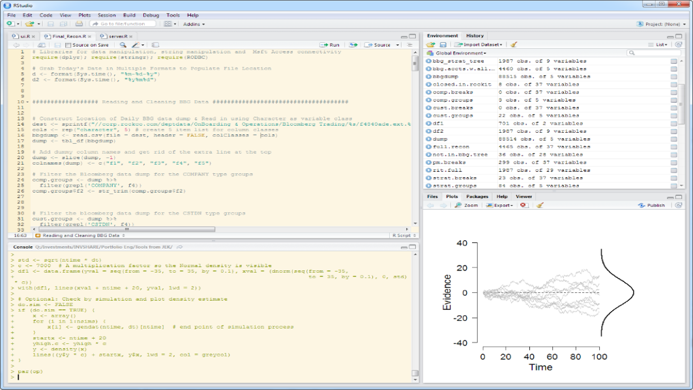

<script src="https://use.fontawesome.com/df424334fe.js"></script>
<style>
hr { width:100%; height:2px; background: #366A86 }
.reveal section h2 {
  color: #366A86;
}
.small-code pre code {
  font-size: .75em;
}
.midcenter {
    position: fixed;
    top: 50%;
    left: 50%;
}
.fullscreen {
    position: fixed;
    top: 50%;
    left: 50%;
    width: 1440px;
    height: 900px;
}
.topright {
    position: absolute;
    top: 5px;
    right: 5px;
    display: in-line;
    height: 44px;
    width: 350x;
}
.bottom {
    position: absolute;
    bottom: 50px;
    display: block;
    height: 150px;
    width: 1440;
}
</style>


## Questions
<hr />
* What are we looking for?
* What is R?
* Why use R?
* How do you use R?
* How can we build a platform from a data analysis language?
* Interoperability

<div class="topright">
</img>
</div>

---&twocol

## What are we looking for?
<hr />
***=left
* Clean, well organized, audited data master
* Data Warehouse
     * Centralized data model
     * Carve-outs for particular depts/teams
* Flexibility for bespoke reporting needs
     


***=right
* Automated data analysis & reporting
* Interactive data mining
* Static & dynamic reports
* Operational tools & forms
     * Trade order
     * Event tracking


[Source: R for Data Science - Hadley Hickham](http://r4ds.had.co.nz/intro.html)

<div class="topright">
</img>
</div>

---

## What is R?
<hr />

<iframe width="560" height="315" src="https://www.youtube.com/embed/TR2bHSJ_eck" frameborder="0" allowfullscreen></iframe>

<div class="topright">
</img>
</div>

---&twocol

## What is R?
<hr />

***=left
* Programming Language - Functional & OO
* Software for interactive data analysis
* Environment for statistical analysis - descriptive & predictive
* Open-Source project
     * Scrutiny and tinkering by thousands of users & developers
     * Very high standard of quality & accuracy
     * Open interface allows it to interact with many other applications and systems

***=right
* R is a dialect of S
     * Invented by John Chambers at Bell Labs, '76
* R was created by Drs. Robert Gentlemen & Ross Ihaka 
     * Initial release - '94
* Written primarily in C, Fortran, and R
* Supported by the R Foundation & R Core Development Team
     * Leading statisticians and computer scientists

<div class="topright">
</img>
</div>

---.small-code


```r
set.seed(12); means <- NULL
for(i in 1:1000){
     rands <- rnorm(1000, 5, 25)
     avg <- mean(rands)
     means[i] <- avg
}
par(mfrow = c(1, 2))
hist(means, breaks = 15)
abline(v = mean(means), lwd = 2, col = 'red')
text(round(mean(means),2), x = 5.3, y = 253)
plot(density(means), col = 'blue')
abline(v = mean(means), lwd = 2, col = 'red')
```


<div class="topright">
</img>
</div>

---&twocol

## Why R?
<hr />
***=left
> * R is specialized for data analysis & communication
* Enormous library of packages that extend base functionality
     * Standing on the shoulders of giants
> * Extremely active online community of developers and users
* Abstracts away complicated CS concerns

<div style="text-align: center;"></div>


***=right
> * “Whatever you (Excel) can do, I can do better…and a lot more”
* Flexible – can work with just about any data structure
> * 2 million users worldwide
* One language to do (almost) everything
     * Plumbing
     * Profiling/Validation
     * Modeling/Analysis
     * Viz
     * Reports
     * Delivery

<div class="topright">
</img>
</div>

---


<div class="midcenter" style="margin-left:-360px; margin-top:-250px; font-size:18px;">
     
          <figcaption>
               <a href = "http://jkunst.com/r/what-do-we-ask-in-stackoverflow/">
               Source: What do we ask Stack Overflow?, Joshua Knust Dec 2015
               </a>
          </figcaption>
     </img>
</div>

<div class="topright">
</img>
</div>

---

## Good Press
<hr />

> …It is becoming their (data analysts) lingua franca partly because data mining has entered a golden age, whether being used to set ad prices, find new drug faster or fine-tune financial models. Companies as diverse as Google, Pfizer, merck, Bank of America, the InterContinental Hotels Group and Shell use it.

[*Data Analysts Captivated by R’s Power*, The New York Time, Jan 2009](http://www.nytimes.com/2009/01/07/technology/business-computing/07program.html?pagewanted=all&_r=0)
 
 > Microsoft wants a slice of the big data analytics pie. Truth be told, it has already baked and served itself up a portion by acquiring the R-language and data crunching specialist Revolution Analytics...In non-developer-speak then, R is a popular open-source statistical computing language well suited to the ‘new’ world of enterprise class big data analytics. For the record, we used to call this stuff ‘data mining’ back in the 1990s (some people still do), so don’t believe ALL the big data hype you read — regardless, times have changed and we’re better at it now.
 
[*Microsoft R: One Big Data Tool To Rule Them All?*, Forbes, Jan 2016](http://www.forbes.com/sites/adrianbridgwater/2016/01/15/microsoft-r-one-big-data-tool-to-rule-them-all/#7925523f3d10)

<div class="topright">
</img>
</div>

---&twocol

## A Widely Used Tool
<hr />

***=right

Data Scientist, Digital Intelligence - J.P. Morgan
> High-level problem solver who uses advanced techniques...to develop solutions that help businesses and organizations operate more efficiently and cost-effectively

> Must be able to write clean and concise code in at least two of the following…R, Python, Java, and Scala. Our interview process includes writing some code to solve a problem on the whiteboard…

Data Developer, Institutional Equity Division, Morgan Stanley
> Data analysts work alongside quantiative research staff and traders...emphasis is placed on data quality, thoughtful design, system robustness and operational integrity.

> Qualifications…Experience with SAS, R or other statistical packages a plus…

***=left

Corporate & Investment Bank, Data Science & Analytics - J.P. Morgan
> Build an in-depth understanding of available data assets... Perform ad-hoc explorator statistics and data mining tasks on diverse data sets from small scale to big data...Participate in data architecture and engineering to support analytics... Investigate data visualization and summarization... Communicate findings to stakeholders... Code the solutions...

> Key Requirements…Experience in at least one specialized statistical computing environment, preferably R…

Market Risk Stress Testing Analyst, Morgan Stanley
> Skills Required (Essential)…Strong IT skills are required to facilitate data analysis; competence with SQL, R, MS Excel and VBA is required…


<div class="topright">
</img>
</div>

---

## How to use R? - RStudio
<hr />
* Top of the line IDE - Makes using R easy and efficient
* Docked windows
* Text editor, console, file/environment explorer, graphics preview and more
* RStudio is a major contributor to the R project & is responsible for some of the most widely used libraries
* Open-Source (AGPL v3) & commercial versions
* Local or hosted
* Used widely in academics & enterprise

<div class="topright">
</img>
</div>

<div class="bottom">
</img>
</div>


---

<div class="fullscreen" style="margin-left:-531px; margin-top:-300px;">
</img>
</div>

<div class="topright">
</img>
</div>

---&twocol

## Shiny Apps
<hr />

<div class="topright">
</img>
</div>

*** =left

* Elegant and powerful R framework from RStudio to develop modern response apps without requiring direct use of HTML, CSS or JS
* Rapid development and iteration time
* Compelling interactive tools with the power to communicate complex analysis
* Allows anyone to run an R script/program on command at the click of a button

*** =right

* Hosted on private cloud using Shiny Server Pro
* Supports authentication
* Samples: [Gallery](http://shiny.rstudio.com/gallery/) & [Showcase](https://www.rstudio.com/products/shiny/shiny-user-showcase/)
* [Retirement Simulator](http://shiny.rstudio.com/gallery/retirement-simulation.html)
* [Simple Linear Regression](https://gallery.shinyapps.io/slr_diag/)
* [Dynamic Dashboards with Shiny](https://vimeo.com/125265016)

---

<iframe src="https://player.vimeo.com/video/97466638?color=428bca&title=0&byline=0&portrait=0" width="640" height="360" frameborder="0" webkitallowfullscreen mozallowfullscreen allowfullscreen></iframe>
<p><a href="https://vimeo.com/97466638">Shiny Overview - 5:20</a> from <a href="https://vimeo.com/rstudioinc">RStudio, Inc.</a> on <a href="https://vimeo.com">Vimeo</a>.</p>

<div class="topright">
</img>
</div>

---&twocol

## Interoperability - Microsoft & Flexibility
<hr />

***=left

- Microsoft didn't just adopt the open-source tool into their stack, they are taking a leadership role in the R open-source community 
* January 2015 - Microsoft acquires the standard-bearer in Enterprise R, [Revolution Analytics](www.revolutionanalytics.com)
* "Enhanced distribution of R from Microsoft"
* R has become central in Microsoft's data analytics strategy
* **SQL Server 2016 natively supports R**


***=right

* Sometimes another language/tool is needed
* R plays well with C, Python, VBA, Others
* Can connect directly to databases
* Can write and style Excel spreadsheets
* Can weave together writing and graphics into compelling data products

<div style="text-align: center;"></div>


<div class="topright">
</img>
</div>

---#custbg

<style>
#custbg {
  background-image:url(assets/img/appformsample.png); 
  background-repeat: no-repeat;
  background-position: center center;
  background-size: contain;
}
</style>


---#custbg2

<style>
#custbg2 {
  background-image:url(assets/img/appdashboard.png); 
  background-repeat: no-repeat;
  background-position: center center;
  background-size: contain;
}
</style>

---

## Filling the Gaps

* Data Modeling & Database Management Tool
     * [Navicat for SQL Server](https://www.navicat.com/)
     * Commercial & Enterprise Editions Available
     
* Workflow Automation & Job Scheduling
     * [Airflow: A Workflow Management Platform](http://nerds.airbnb.com/airflow/)
     * Open-Source

---#custbg3

<style>
#custbg3 {
  background-image:url(assets/img/masterplan2.png); 
  background-repeat: no-repeat;
  background-position: center center;
  background-size: contain;
}
</style>

---

## Links
<hr />

* [R-Project](https://www.r-project.org/)
* [RStudio](https://www.rstudio.com/)
* [ShinyApps](https://www.rstudio.com/products/shiny/)
* [useR! Conference](http://user2016.org/)
* [rstudio::conf](https://www.rstudio.com/conference/)
* [RStudio Workshops](https://www.rstudio.com/workshops/)
* [Microsoft R Server](https://www.microsoft.com/en-us/cloud-platform/r-server)
* [Microsoft R Open](https://mran.revolutionanalytics.com/rro/)
* [SQL Server 2016 R Services](https://msdn.microsoft.com/library/mt696069\(SQL.130\).aspx)
* [Revolution Analytics Blog](http://blog.revolutionanalytics.com/)
